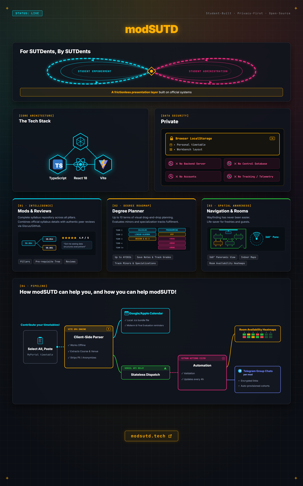

# 🐙 modSUTD

> modSUTD is an independent, student-built project. It is currently not affiliated
> with, endorsed by, or operated by the Singapore University of Technology
> and Design.

Built around SUTD's specifics: pillars (SMT / EPD / ESD / CSD / DAI / ASD / HASS, including cross-pillar mods), 10-term plans, room codes, and the community tooling that came before it.

[](marketing/poster.png)

[Watch the demo on Youtube!](https://youtu.be/UJn3PGKn7M4)

## What you can do with it

- Read and share honest mod reviews.
- Plan a whole SUTD degree, term by term, with prerequisites checked for you.
- Get your MyPortal timetable into Google or Apple Calendar.
- Navigate anywhere and see when it is free.
- And more!

## What it does

One workbench of draggable panels (desktop) / four tabs (mobile):

- **Mods** - all 386 undergraduate mods from the official listing: description, credits, prerequisites (as a navigable tree), official tags, multi-pillar badges, plus workload and grading wherever SUTD actually publishes them. Filter by pillar or term; Start by typing `/` to search for mods and rooms from anywhere.
- **Timetable** - paste your MyPortal "List View" and get a weekly grid, clash detection, and a real `.ics` for Apple/Google/Outlook. Parsing happens entirely in your browser.
- **Plan** - up to a 10-term degree plan with the freshmore core pinned (classic and AY2026 curricula, kept separate), drag-and-drop placement, automatic prerequisite checks, choice slots that count down, specialisation-track badges, and per-mod records (your own scores, computed grade, notes - stored locally, optional private-gist backup on Github).
- **Navigation** - all 225 rooms with a weekly availability heatmap, probe-a-time search, and a map that goes indoors and names the lift lobby to use. Availability comes from crowdsourced timetable contributions.
- **Reviews & suggestions** - honest module reviews and feature suggestions via GitHub Discussions (Giscus). Every engineering SUTDent would need to have one sooner or later.

## Quick start

```bash
git clone https://github.com/modsutd-community/modsutd.git
cd modsutd/frontend
npm install
npm run dev   # http://localhost:3000
```

The `predev` hook copies `/data/*.json` into `frontend/public/data/` so the dev server serves them.

## Layout

```
modsutd/
├── frontend/             React + Vite SPA
│   ├── src/
│   │   ├── workbench/    the app: window manager, panels, plan, records
│   │   ├── views/        pre-workbench pages kept as parity reference
│   │   ├── reducers/     mods, venues, timetable/plans, records
│   │   ├── utils/        timetableParser, icsGenerator, search, loadData
│   │   └── types/        all the TS types
│   ├── api/              six stateless relays (they hold a token, never you)
│   └── scripts/          sync-data.mjs
├── tools/scraper/        Python - gathers official SUTD pages → /data
├── data/                 the catalogue itself (JSON, source of truth)
│   ├── courses/          one file per mod (10_001.json, 50_001.json, …)
│   └── venues/           one file per room
└── docs/                 architecture, data format, map and scraper notes
```

## How it's built

No backend, no database, no analytics: the app reads version-controlled JSON, and every data change is a human-reviewed PR. The stack, what data the site touches, and how it's kept safe are in [docs/architecture.md](docs/architecture.md).

## Contributing

Start at [CONTRIBUTING.md](CONTRIBUTING.md).

Most contributions here involve an AI coding agent - that's fine and expected. [CLAUDE.md](CLAUDE.md) carries the guardrails; PRs also get an automatic LLM review.

## FAQ

**Why a workbench?**

The Fab Lab is a big part, and SUTD is known for being project-intensive. A lot of working parts that can be moved around (on web) rather than a simple set of pages to navigate.

The octopus resembles SUTD's mascot and has nothing to do with fab.io (for now).

**Was AI used to build this?**

Yes, and it made the difference between this existing and not. It will keep
being used for new work and for maintenance. Everything was verified as far as
it could be, so hopefully you will find it is not AI slop.

**How can I help?**

- Features. Anything you wish the site did.
- Bugs. Anything that is wrong, no matter how small.
- Donations. The domain and the hosting are covered by the GitHub Student Developer
  Pack currently, but we would like this to outlast our student era,
  so donations go to the running costs. The Contribute panel on the site carries
  the full breakdown.

## Acknowledgements

Standing on community work that came first:

- [SUTDCalendarConverter](https://github.com/Itsskiip/SUTDCalendarConverter) - [@Itsskiip](https://github.com/Itsskiip).
- [SUTD-Timetable-Extractor](https://github.com/butter9fe/SUTD-Timetable-Extractor) - [@butter9fe](https://github.com/butter9fe).
- [sutd-calendar-fixer](https://github.com/MarkHershey/sutd-calendar-fixer) - [@MarkHershey](https://github.com/MarkHershey).
- @SUTDMapBot (SAMBot) - [@Cherdon](https://github.com/Cherdon).

Made by SUTD students, for SUTD students.
